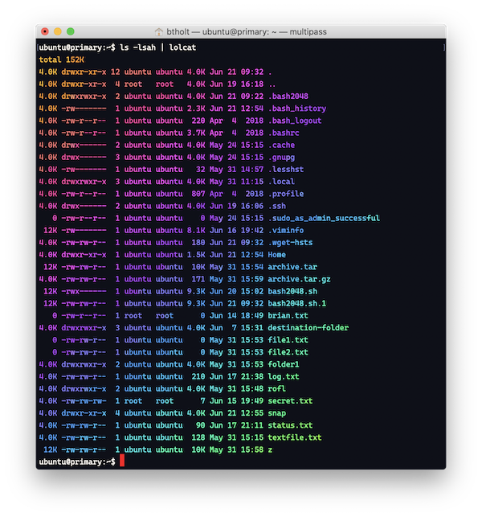

The first tool of interest is APT, advanced packaging tool. This tool has been around for a while and uses dpkg under the hood. There have been several iterations of it so let's make sure you get what APT is going to do for you and how to use it.

## apt-get

A very confusing thing to me when I first using Linux is sometimes I see commands that use apt-get and other times I'd see just apt. What's the difference? Which one should I use? They both hit the same registry and download the same files.

apt-get is older than apt. apt-get is a swiss army knife of apt and has a lot of flexibility and power to do different things. It also pairs wth apt-cache to get accomplish some tasks as well. Since some folks got frustrated that apt-get was a bit difficult how to use and where all the correct commands were, they built a layer on top of it to be more user friendly, apt. Therefore I'd recommend you generally ignore apt-get. There's no problem with the tool and it's not going away, it's just apt is easier to use and remember how to use.

## apt

Okay, so let's chat about apt now. apt is a tool that allows you to download new packages via `apt install`. Let's just nab one now for fun. Run `sudo apt install lolcat`. This will go out and fetch the package lolcat from the apt registry and install. After a second it should download and be immediately be available for use. Now try this: `ls -lsah | lolcat`.

You do need to install packages as root.



Credit to [Sarah Drasner][sarah] for introducing me to this idea.

This is a fun example of using the extended Debian / Ubuntu ecosystem but there are literally thousands of packages available for you to use through apt. Let's try another one.

```bash
node -e "console.log('hi')" # this will fail, Node.js is not installed
apt search nodejs
apt show nodejs
sudo apt install nodejs
node -e "console.log('hi')"
```

Here's a few more commands for you to know

```bash
sudo apt autoremove # will remove unused dependencies
sudo apt update # updates the list of available packages apt uses
apt list # everything installed
apt list --upgradable # everything with an update available
sudo apt upgrade # updates all your packages to their latest available versions
sudo apt full-upgrade # basically autoremove and upgrade together
```

That's pretty much it! While there's no official web browser experience for apt, [check out this open source once][apt].

[sarah]: https://twitter.com/sarah_edo/status/1249702231407857666
[apt]: https://www.apt-browse.org/
